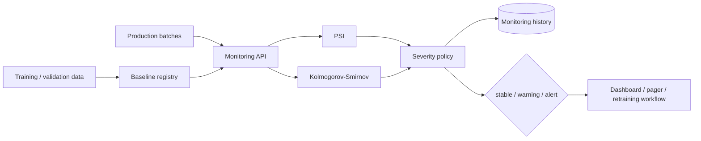

# Model Drift Monitoring

A persistent monitoring service for **feature drift and prediction-score drift**. The repository turns a pair of statistical functions into a small production-shaped system with baseline registration, historical monitoring runs, severity policies, REST APIs, Docker packaging, tests and CI.

## Architecture



## Metrics

### Population Stability Index

PSI compares the proportions of observations that fall into reference-derived bins. The project uses quantile bins from the baseline distribution and clips zero-probability buckets for numerical stability.

Typical demo policy:

- `PSI < 0.10` → stable
- `0.10 <= PSI < 0.25` → warning
- `PSI >= 0.25` → alert

Thresholds are configurable per evaluation request rather than hard-coded into the service contract.

### Kolmogorov-Smirnov test

The two-sample KS statistic measures the maximum distance between empirical cumulative distributions. It is reported next to PSI because relying on one drift metric alone is rarely enough.

### Prediction drift

Prediction-score monitoring also records changes in the mean predicted score. This is useful when an input feature appears stable while model outputs move materially.

## API workflow

Start the service:

```bash
pip install -e '.[dev]'
uvicorn monitoring.api:app --reload
```

Register a reference distribution:

```bash
curl -X PUT http://localhost:8000/models/fraud-v1/baselines/amount_zscore \
  -H 'content-type: application/json' \
  -d '{"values": [0.1, -0.2, 0.4, 0.7, 0.0, ...]}'
```

Evaluate a production batch:

```bash
curl -X POST http://localhost:8000/models/fraud-v1/evaluate/amount_zscore \
  -H 'content-type: application/json' \
  -d '{
    "values": [0.8, 1.2, 0.9, 1.5, ...],
    "psi_warning": 0.10,
    "psi_alert": 0.25
  }'
```

Inspect recent runs:

```bash
curl http://localhost:8000/models/fraud-v1/history/amount_zscore
```

## Why persistence matters

A drift calculation by itself answers only “is this batch different?” Monitoring needs history:

- Was the change sudden or gradual?
- Has the feature been in warning state for several windows?
- Did a deployment coincide with the shift?
- Did prediction drift appear before label-quality degradation became measurable?

The service therefore stores every monitoring report with a model ID, feature name, severity and timestamp.

## Repository layout

```text
model-drift-monitoring/
├── monitoring/
│   ├── api.py
│   └── store.py
├── tests/
│   └── test_monitoring_api.py
├── drift.py
├── Dockerfile
├── pyproject.toml
└── .github/workflows/ci.yml
```

## Production extensions

The public version intentionally stays easy to run locally. Natural extensions include:

- Prometheus metrics and Alertmanager rules;
- scheduled windows from Kafka/Kinesis/Pub/Sub;
- Evidently-style HTML reports;
- data-quality checks before drift evaluation;
- label-delayed performance monitoring;
- calibration drift;
- segment-specific baselines;
- S3/GCS baseline artifacts;
- automatic retraining tickets rather than automatic retraining by default.

## Interview topics demonstrated

`data drift` · `concept drift` · `PSI` · `KS test` · `prediction drift` · `baseline registry` · `monitoring windows` · `alert thresholds` · `observability` · `retraining triggers` · `MLOps`
