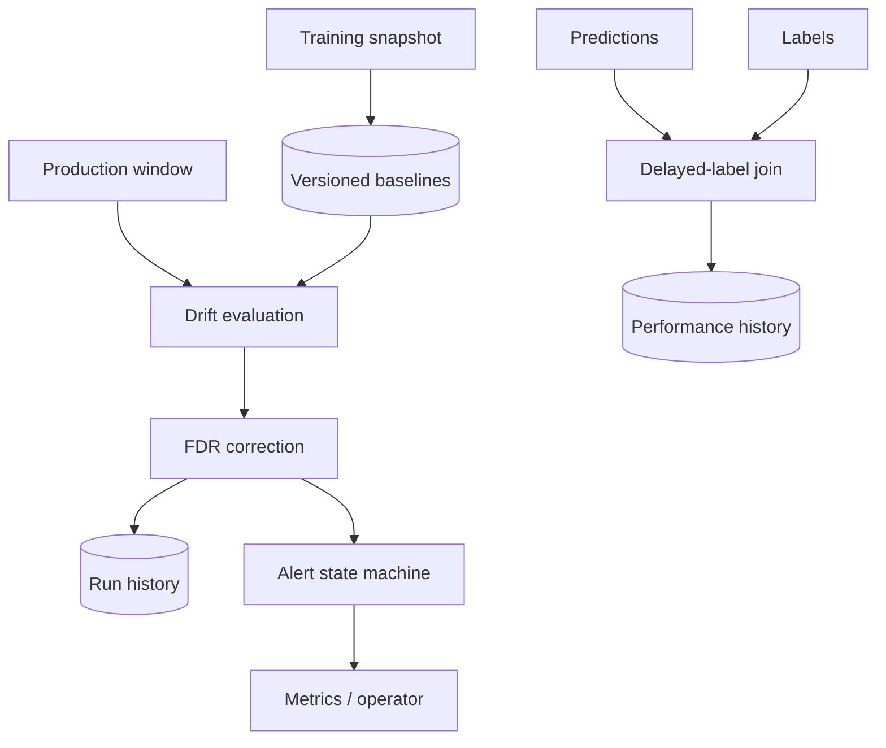
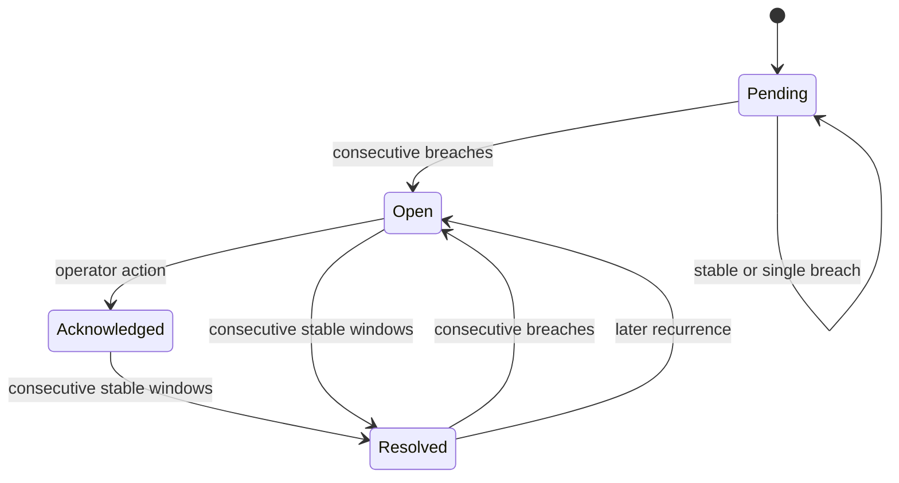

# Model Drift Control Plane

[](https://github.com/cagataykavas/model-drift-monitoring/actions/workflows/ci.yml)

A persistent monitoring service for **versioned feature baselines, numeric and categorical drift, prediction drift, delayed-label performance, multiple-testing control and operational alert lifecycle**.

This repository separates three questions that toy drift scripts usually collapse:

1. Did the input or score distribution change?
2. Did model quality change once labels arrived?
3. Is the signal persistent enough to page a human?

## Control-plane architecture



## Statistical surface

| Data kind | Metrics | Important behavior |
|---|---|---|
| Numeric | PSI, two-sample KS, normalized Wasserstein, missing-rate delta | reference quantile bins, constant-baseline safety, finite-value validation |
| Categorical | Jensen–Shannon divergence, unseen-category rate, missing-rate delta | explicit missing bucket and new category detection |
| Prediction score | numeric drift metrics | version-scoped baseline; no accuracy inference without labels |
| Delayed labels | Brier, log-loss, ROC AUC, accuracy, precision, recall, ECE | entity-key join; single-class AUC is reported as unavailable |

When a window evaluates several numeric features, KS p-values are corrected together using **Benjamini–Hochberg**. Effect-size metrics still remain visible. This reduces the “monitor 100 columns, eventually page on random p-values” failure mode.


## Explanation drift

`monitoring/explanation_drift.py` compares signed aggregate attribution profiles from a
reviewed baseline window and a current window. It reports:

- overlap between the highest-magnitude features;
- cosine similarity of the full signed attribution profile;
- attribution-direction agreement;
- normalized L1 magnitude shift;
- deterministic per-feature shift evidence and policy reasons.

This detects a model relying on materially different signals even when input and prediction
distributions appear stable. It is model-agnostic and accepts attribution aggregates from SHAP,
permutation/sensitivity methods or another consistent explainer.

The gate assumes the same model/explainer configuration, feature definitions and aggregation
method in both windows. Explanation drift is diagnostic evidence, not proof of causal change,
unfairness or degraded predictive performance.

## Baseline governance

A baseline identity is `(model_id, model_version, feature_name, feature_kind)`. Registration stores canonical content fingerprints and never silently overwrites history:

- the same fingerprint is an idempotent replay;
- changed content creates a new baseline version;
- exactly one baseline is active per model/version/feature;
- a kind mismatch is rejected;
- every monitoring run records the baseline ID it used;
- a repeated window ID returns a conflict instead of double-counting evidence.

## Alert lifecycle



A single noisy window can be stored without paging. Default policy opens after two consecutive warning/alert windows and resolves after two stable windows. Recurrence count, breach/stable streaks, first/last seen time, acknowledgement and resolution are durable.

## API

| Method | Path | Purpose |
|---|---|---|
| `POST` | `/v1/baselines` | register/activate a content-addressed baseline |
| `POST` | `/v1/windows/evaluate` | evaluate up to 200 features with FDR control |
| `GET` | `/v1/models/{id}/versions/{version}/features/{feature}/history` | baseline-linked history |
| `POST` | `/v1/predictions` | ingest scored entities and event time |
| `POST` | `/v1/labels` | ingest labels when they become observable |
| `POST` | `/v1/models/{id}/versions/{version}/performance/{window}/evaluate` | join and score delayed labels |
| `GET` | `/v1/alerts` | filterable alert registry |
| `POST` | `/v1/alerts/{key}/acknowledge` | operator acknowledgement |
| `GET` | `/metrics` | Prometheus evaluation and active-alert metrics |

```bash
pip install -e '.[dev]'
uvicorn monitoring.api:app --reload
```

The FastAPI app is constructed through `create_app(store)`, so tests do not mutate module globals or leak state between databases.

## Reproducible evidence

```bash
drift-reference \
  --database artifacts/reference.db \
  --output artifacts/reference-report.json
```

The deterministic scenario registers three credit-risk baselines, evaluates two strongly shifted multi-feature windows, opens persistent alerts, joins 200 delayed labels and writes the drift plus performance evidence as JSON. CI executes the command from an installed wheel outside the source checkout and uploads `drift-control-plane-evidence`.

The artifact proves deterministic control-flow and metric regressions. It is not presented as production prevalence, model quality or latency evidence.

## Repository map

```text
monitoring/models.py       typed identities, metrics, reports and alert states
monitoring/metrics.py      numeric/categorical statistics and FDR correction
monitoring/performance.py  delayed-label classification and calibration metrics
monitoring/engine.py       feature evaluation and multi-feature correction
monitoring/store.py        version registry, runs, labels and alert state
monitoring/api.py          app factory and versioned HTTP contract
monitoring/demo.py         deterministic evidence producer
tests/                     statistics, persistence, API and lifecycle tests
```

`drift.py` remains as a small compatibility/example module; production behavior lives in the package.

## Container and CI

The multi-stage image builds a wheel, installs only runtime dependencies, runs as UID `10001`, owns its `/data` volume and exposes a real healthcheck. CI verifies:

- Ruff lint and format;
- 20 behavioral tests;
- sdist/wheel build;
- isolated wheel installation and JSON evidence;
- container build and live health probe.

```bash
ruff check .
ruff format --check .
pytest -q
python -m build
docker build -t model-drift-monitoring .
```

## Honest boundaries

Automatic retraining is deliberately not triggered from a drift score. Drift can reflect upstream breakage, seasonality, policy changes or genuine population movement. This control plane records evidence and creates an operator-owned alert; model promotion remains a separate governed workflow.
